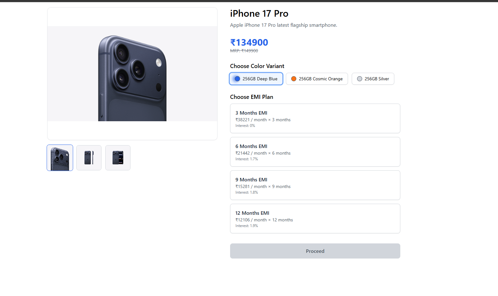
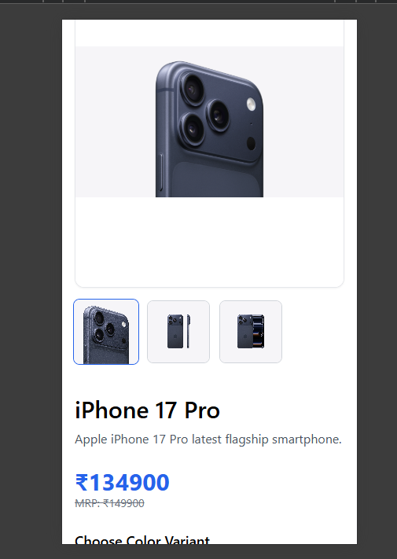

# 1Fi Full Stack Developer Assignment - Study Phone EMI App

A simple full-stack web application displaying smartphones with multiple EMI plans. Built using React, Node.js, Express, and MongoDB. The app retrieves dynamic data from the backend and presents it in a responsive, user-friendly interface.

---

## 🌐 Demo Link
[View Live Demo](https://cellphone-frontend.vercel.app/)

---

## 📸 Screenshots

### DesktopView of Product detail page

### Cellphoneview of Product detail page

---

## 📂 Project Structure

root
├── backend
│ ├── config
│ ├── controllers
│ ├── models
│ ├── routes
│ └── seed
├── frontend
│ ├── src
│ │ ├── pages
│ │ ├── services
│ │ └── assets
└── README.md

---

## 🛠 Tech Stack

- **Frontend:** React, Tailwind CSS, React Router
- **Backend:** Node.js, Express
- **Database:** MongoDB
- **Deployment:** Vercel (Frontend), Render (Backend)
- **Others:** Axios for API calls, Cloudinary for image hosting

---

## 🔗 API Endpoints

### Get all products

GET /api/v1/product
Response:
{
success: true,
data: [
{
_id: "string",
name: "Product Name",
slug: "product-slug",
description: "Product description",
variants: [
{
title: "Variant Name",
price: 12345,
mrp: 15000,
images: ["url1", "url2"]
}
],
emiPlans: [
{
name: "3 Months EMI",
tenureMonths: 3,
monthly: 43500,
interestRate: 0,
cashback: ""
}
]
}
]
}

### Get product by slug
GET /api/v1/product/:slug
Response: Same structure as above, filtered by slug

---

## ⚡ Features

- Displays 3 smartphones with multiple variants (color/storage)
- Dynamic calculation of EMI totals with interest
- Variant selection updates product images and price
- Responsive design for mobile, tablet, and desktop
- Loader shown while fetching data from backend
- Unique URLs for each product
- Data fetched dynamically from MongoDB (no hardcoding)

---

## 📝 Setup Instructions

### Backend
1. Clone the repo:

git clone <repo-link>
2. Navigate to backend folder:
3. Install dependencies:
 4. Create `.env` file with:
PORT=4000
MONGO_URI=<your-mongodb-connection-string>
CLOUDINARY_CLOUD_NAME=<cloud-name>
CLOUDINARY_API_KEY=<api-key>
CLOUDINARY_API_SECRET=<api-secret>

5. Seed the database:
6. Start the server:

npm run dev

### Frontend
1. main folder is the frontend folder :
2. Install dependencies:
3. Create `.env` file with:
REACT_APP_BASE_URL=https://cellphone-backend.onrender.com/api/v1/product
4. Start the app:
npm start

---

## 🔍 Notes

- The project includes 3 products: iPhone, Samsung, OnePlus
- Each product has 2+ variants and multiple EMI plans
- All data is dynamic from MongoDB
- Loader/spinner added on homepage and product page for smooth UX

---

## 📦 Database Schema

### Product Model
- `name`: String
- `slug`: String
- `description`: String
- `variants`: Array of objects
  - `title`: String
  - `price`: Number
  - `mrp`: Number
  - `images`: Array of image URLs
- `emiPlans`: Array of objects
  - `name`: String
  - `tenureMonths`: Number
  - `monthly`: Number
  - `interestRate`: Number
  - `cashback`: String

---

## 📌 Submission

- Live Frontend: [Vercel Link](https://cellphone-frontend.vercel.app/)  
- Backend API: [Render Link](https://cellphone-backend.onrender.com/api/v1/product)  
- MongoDB: Seeded with sample products, variants, and EMI plans
